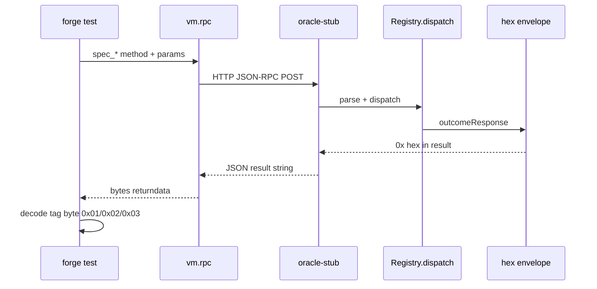
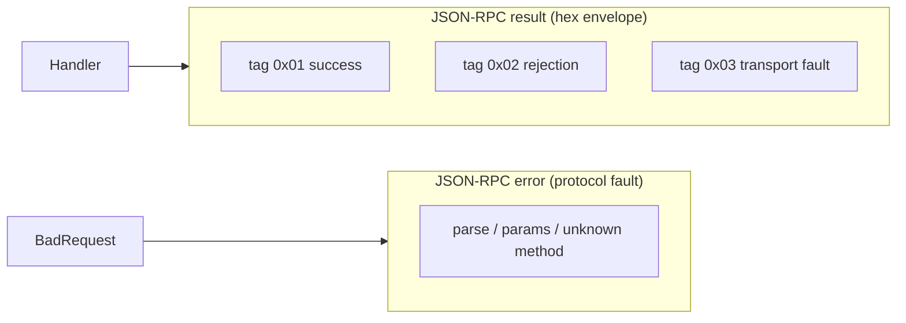

# evm-spec-bridge

A Haskell JSON-RPC oracle for Foundry: call a typed Haskell spec from `forge test`, compare
the answer to on-chain behaviour, and fail the build on divergence.

**Core value:** spec success, spec rejection, and transport failure are never conflated.

## End-to-end flow



## Outcome channels



Spec outcomes **always** travel in `result` as a single `0x…` hex string. The `error` field is
reserved for request-level faults (`-32601` unknown method, `-32602` bad params, `-32700` parse).

## `spec_*` method surface (Phase 4)

| Method | Purpose |
|--------|---------|
| `spec_health` | Domain-shaped success envelope (32-byte sentinel) — proves payloads survive the trip |
| `spec_fixtureRejection` | Fixed `SpecRejection` in `result` (tag `0x02`) |
| `spec_fixtureTransportFault` | Fixed in-envelope fault (tag `0x03`) |
| `spec_probe` / `spec_boundary` | Phase 3 dev methods (`--mode` on stub) |

Non-`spec_*` methods → `-32601`. Notifications, batches, unknown fields → typed fault codes.

## Quick reference

- **Components:** `registry` (dispatch), `transport` (HTTP), `oracle-stub` (runnable server)
- **Strict decode:** unknown JSON fields, null/missing `id`, batch arrays rejected — never silently defaulted
- **Purity:** fixture handlers are a function of the request alone (tested invariant)
- **Planning:** `.planning/ROADMAP.md`, requirements, phase notes

## Run locally

```bash
stack build --test --pedantic   # Haskell unit + property tests
just health                     # spec_health smoke (curl)
just fixtures                   # Solidity fixture methods (forge)
just discriminate               # Phase 3 rejection vs transport discrimination
just boundary-sweep             # Phase 3 boundary vectors through forge
just wedge-red                  # Phase 3 wedged oracle goes red (~45s)
```

Start the stub manually: `stack exec -- oracle-stub --mode success --port 8899`

Set `EVM_SPEC_BRIDGE_URL=http://127.0.0.1:8899` in `solidity/foundry.toml` `[rpc_endpoints]` for forge tests.

## Repos

- Canonical: `d2p-finance/evm-spec-bridge` — receives pull requests only
- Development fork: `JMSBPP/evm-spec-bridge` — `develop` is the integration branch
